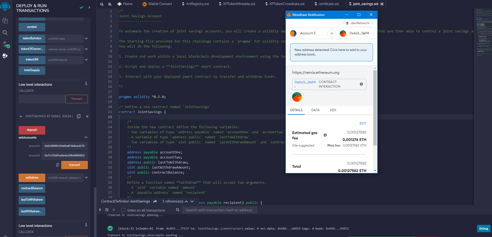
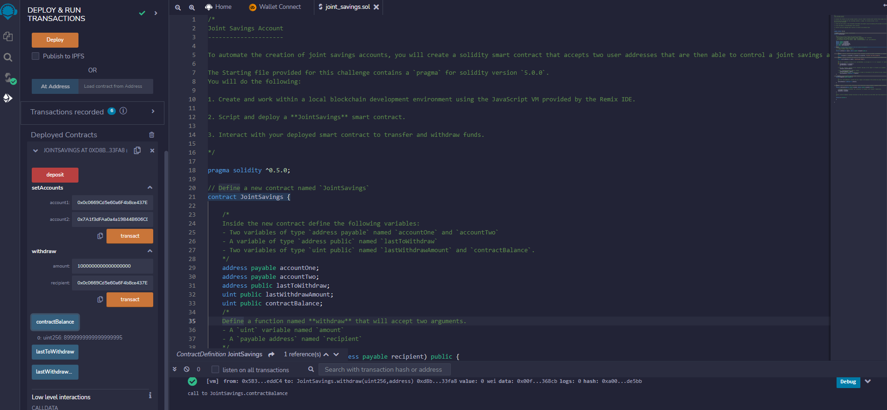
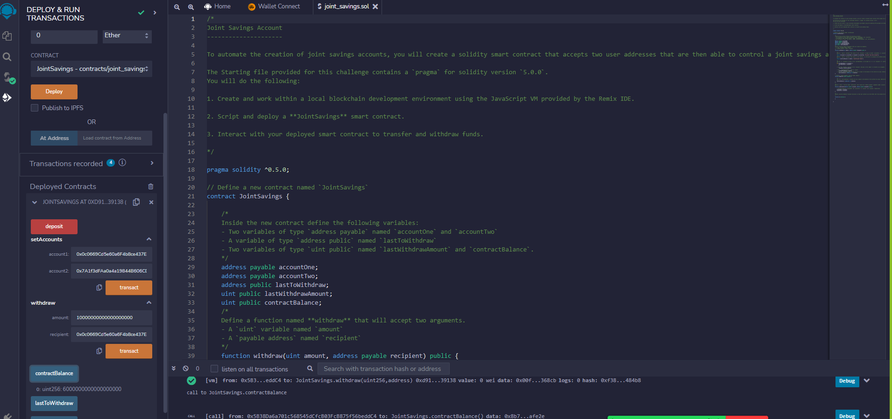
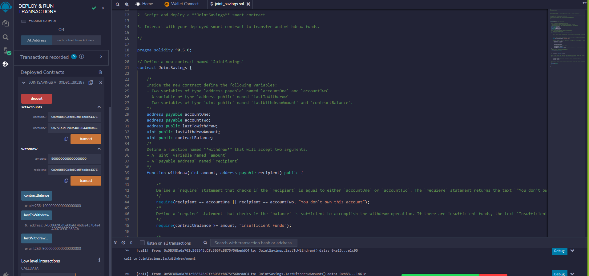

# joint_savings
A joint savings account written with Solidity

Using the "Set Accounts" function 

Sending 1 Ether 

Sending 5 Ether 

Sending 10 Ether 

Using the "Last Withdraw and Last to Withdraw" functions 

